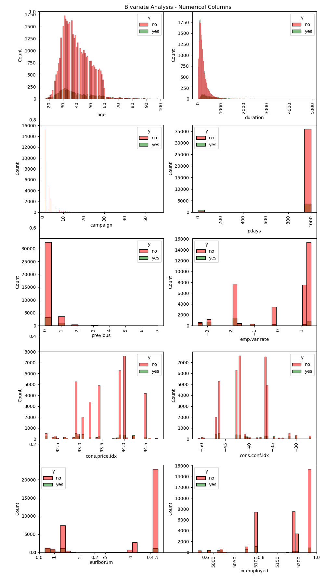

# assignment_17
 Assignment 17

 **URL for the assignment:** 
```
https://github.com/hegdesan-us/assignment_17.git
```
 **URL for solution Jupyter notebook:** 
```
[prompt_III.ipynb](https://github.com/hegdesan-us/assignment_17/blob/c0b910b7f9078b128a4f284e30b062b9fa5ab0d4/prompt_III.ipynb)
```

**Name :** Sanjay Hegde \
**Couse :** UCB AI/ML 

**Directory :** Images \
  Description : Contains the images needed for the prompt questions and the Jupyter notebook 

**Directory : data** \
 Description : Contains the data file needed for the class project\
 Contains file : bank-additional-full.csv

### Data Preperation
 **Heatmap of Missing values**

 
 

- Droping unique value columns as it can't be used for model. id, vin
- Droping region as state can be used instead
- Dropping size as 71% information is missing
- Dropping paint_color as 30% information is missing
- Dropping Drive as 30% information is missing


## Exploratory Data Analysis (EDA)
In this section of the project, the data is explored to see the patterns and trends and observe interesting insights. Below are some interesting observations generated.

- Age - The age between 30 - 40 has more Bank customer as compared to age > 60 years.
- Duration - More customers are contacted brtween 50 - 250 second and as the time duration increased the customers count get decreased.
- campaign - Approximately 80 % of customers are contacted between 1 - 3 times campaign.
- pdays - Approximately 96 % customers has not contacted from previous campaign .
- Previous - Previous graph shows that maximum customers has not contacted before this Campaign.
- emp.var.rate , cons.price.idx , cons.conf.idx , euribor3m , nr.employed are not normaly distributed.


- Job - Approximately 70 % of customers are working in "Service" , "admin" , "blue-collar" & "technician" field.
- Marital - 60 % customers are married , 28 % are single , 11 % are divorced and 1 % are unknown.
- Education - 29.5 % customers have univercity degree , 23 % are high shool , 10 % have professional course and remaining have 9y,6y,4y,unknown. but 15 - 16 customers are illiterate.
- default - 80 % customers has not defaulted but 20 % customers has defaulted(maked mistakes).
- Housing - 52 % customers has House loan , 45 % has not taken any house Loan and about 3 % customer is unknown.
- Loan - 82 % customers have not any personal loan , 15 % have personal loan & Remaining 3 % details is unknown.
- contact - 63.5 % customers have cellular type and remaining 36.5 % have telephone type contact.
- Month - more than 50 % customers are contacted only in "may" & "july" month.
- day_of_week - All customers are choose All weekdays in equal ratio.
- Poutcome - Only 3 % of campaign got success and 86 % is nonexistant.

Y - only 11 % customers have Subscribed the banks Term plan.


<h2> Visualizations</h2>

Distribution of Price

 

 


Distribution of Price

 

 
 
Outlier Analusis

 

 


Correlation Heatmap


 

 
## Machine Learning Models 


Now, we aim to compare the performance of the Logistic Regression model to our KNN algorithm, Decision Tree, and SVM models.  Using the default settings for each of the models, fit and score each.  Also, be sure to compare the fit time of each of the models.  Present your findings in a `DataFrame` similar to that below: 


| __Machine Learning Models__| __Train Time (sec)__| __Train Accuracy__|__Test Accuracy__|
| :-:| :-:| :-:|:-:|
|  Baseline   |  0.003  |0.58    |0.58    |
|  Lin Reg    |  0.02   |0.35    |0.35   |
|  Log Reg    |  0.44   |0.75    |0.75   |
|  KNN   |  0.012  |0.89    |0.84    |
|  SVM   |  80  |0.76    |0.76    |
|  RF   |  9.14  |0.99    |0.87    |
|  DTree   |  0.21  |0.99    |0.82    |


 
 

## Major Feature considered for hyperparameter tuing
Looking at the random forest model, here are some major features impacting the model


{'transformer__polynomialfeatures__degree': 5}

Here are some major features based on the importance
- year    0.324 +/- 0.002
- model   0.253 +/- 0.001
- odometer0.069 +/- 0.001
- fuel    0.033 +/- 0.001
- transmission0.023 +/- 0.000
- cylinders0.017 +/- 0.000
- type    0.012 +/- 0.000
- state   0.006 +/- 0.000
- title_status0.006 +/- 0.000
- manufacturer0.005 +/- 0.000
- condition0.001 +/- 0.000

 

**Next steps**

- Iterate through models based on selective features for better price model


 

 
